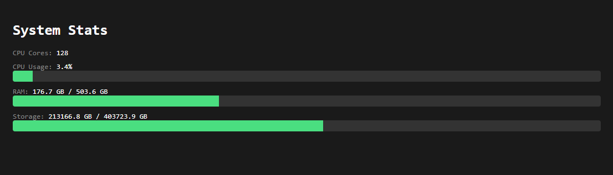

# tiny-stats

A lightweight Node.js WebSocket server that broadcasts system stats (CPU cores, CPU usage, RAM, and storage) to any connected client. Uses only the built-in `os` module for stats collection, with `ws` as the only dependency.

Run with `npm start` and open `http://localhost:7828` to view the dashboard, or connect to `ws://localhost:7828` from any origin to receive JSON stats. Configure with `PORT` and `INTERVAL` (ms) environment variables.
